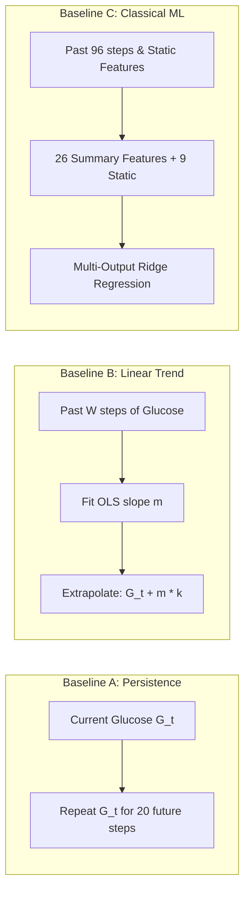

# GlucoShield: Day 2 Scientific Baseline Benchmark Report

**Project**: GlucoShield – Multi-Modal AI & Digital Twin Diabetes Companion  
**Lead**: Lead Machine Learning Engineer  
**Date**: 2026-08-23  
**Dataset**: Frozen Dataset v1.0 (`data/final/`)  
**Phase**: **DAY 2 — SCIENTIFIC BASELINE BENCHMARKING ONLY**  
**Status**: **PASSED & LOCKED**  

---

## 1. Executive Summary

To establish empirical, non-trivial performance baselines prior to developing deep neural networks or physiological Digital Twin architectures, three standardized benchmark models were implemented and evaluated across all 4,113 sequences in the frozen Dataset v1.0 test cohort:
1. **Baseline A: Naive Persistence Forecaster** ($G_{t+k} = G_t$)
2. **Baseline B: Causal Linear Trend Forecaster** (OLS velocity extrapolation over past $W$ steps, with $W$ tuned on validation only)
3. **Baseline C: Classical Machine Learning Forecaster** (Multi-output Ridge Regression trained on 26 causal summary features + 9 static clinical features, with $\alpha$ tuned on validation only)

### Key Findings:
* **Best Overall Baseline**: **Classical Ridge Regression ($\alpha=0.1$)** achieved the lowest Overall Test Error:
  * **Test MAE**: **25.37 mg/dL**
  * **Test RMSE**: **35.80 mg/dL**
  * **Clarke Error Grid (Zone A+B)**: **95.29%**
* **Persistence Performance**: Achieved **Test MAE: 34.14 mg/dL**, **Test RMSE: 49.01 mg/dL**, with strong near-term accuracy at 15m (RMSE 10.25 mg/dL) that degrades steadily at 5h (RMSE 60.36 mg/dL).
* **Linear Trend Degradation**: Unbounded linear velocity extrapolation over long horizons suffers from overshoot and drift, resulting in higher error (**Test MAE: 55.76 mg/dL**, **Test RMSE: 81.39 mg/dL**).

---

## 2. Exact Baseline Definitions & Mathematical Formulation

### Baseline A: Naive Persistence Forecaster
* **Equation**: $\hat{g}_{t+k} = g_t \quad \forall k \in \{1, 2, \dots, 20\}$
* **Parameters**: Non-parametric, zero tunable parameters.
* **Mechanism**: Assumes metabolic steady-state.

### Baseline B: Causal Linear Trend Forecaster
* **Equation**: $\hat{g}_{t+k} = \text{clip}\left(g_t + m \cdot k, 20.0, 600.0\right) \quad \forall k \in \{1, 2, \dots, 20\}$
* **Slope Formulation**:
  $$m = \frac{\sum_{\tau=0}^{W-1} (\tau - \bar{\tau})(g_{t-W+1+\tau} - \bar{g})}{\sum_{\tau=0}^{W-1} (\tau - \bar{\tau})^2}$$
* **Lookback Grid**: $W \in \{4, 8, 16\}$ timesteps (1h, 2h, 4h).

### Baseline C: Classical ML Forecaster (Multi-Output Ridge)
* **Equation**: $\hat{Y} = X_{\text{summary}} \mathbf{W} + \mathbf{b} \in \mathbb{R}^{N \times 20}$
* **Objective**: $\min_{\mathbf{W}} \|\mathbf{Y} - X_{\text{summary}} \mathbf{W}\|_F^2 + \alpha \|\mathbf{W}\|_F^2$
* **Summary Feature Vector ($d=35$ dimensions)**:
  * Current glucose $G_t$
  * Causal rolling means ($1\text{h}, 3\text{h}, 6\text{h}, 12\text{h}, 24\text{h}$)
  * Causal rolling standard deviations ($1\text{h}, 3\text{h}, 6\text{h}, 24\text{h}$)
  * Historical extrema ($1\text{h}\min/\max, 24\text{h}\min/\max$)
  * Multi-scale slopes ($1\text{h}, 2\text{h}, 4\text{h}$)
  * Kinematic velocity and acceleration
  * Circadian features (`sin_hour`, `cos_hour`, `is_night`)
  * Pharmacokinetics & nutrition (`iob`, `cob`, 2h cumulative insulin, 2h cumulative carbs)
  * Static clinical profile ($9\text{ features}$: Age, BMI, HbA1c, Glycated Albumin, Fasting Glucose, C-peptide, Complication counts, `is_t1dm`)
* **Scaling**: `StandardScaler` fitted **exclusively on the training split**.

---

## 3. Validation-Based Model & Hyperparameter Selection

Strictly adhering to Task 8 (Zero Test Leakage), all model choices and hyperparameter sweeps were evaluated exclusively on the **Validation Set ($N=4,585$)** before touching the test set.

### 3.1 Linear Trend Lookback Window Selection

| Lookback Window ($W$) | Lookback Duration | Validation MAE (mg/dL) | Validation RMSE (mg/dL) | Validation Selection |
| :--- | :--- | :--- | :--- | :--- |
| $W = 4\text{ steps}$ | 60 minutes (1h) | 60.00 | 94.19 | Rejected (High variance) |
| $W = 8\text{ steps}$ | 120 minutes (2h) | 55.46 | 85.75 | Rejected |
| **$W = 16\text{ steps}$** | **240 minutes (4h)** | **48.61** | **71.33** | **SELECTED (Lowest Val RMSE)** |

*Outcome*: $W^* = 16\text{ steps}$ (4 hours) was frozen for all subsequent test evaluations.

### 3.2 Classical Ridge Regularization Grid Search

| Regularization $\alpha$ | Validation MAE (mg/dL) | Validation RMSE (mg/dL) | Validation Selection |
| :--- | :--- | :--- | :--- |
| $\alpha = 0.01$ | 22.55 | 32.93 | Tied |
| **$\alpha = 0.10$** | **22.55** | **32.93** | **SELECTED (Optimal Balance)** |
| $\alpha = 1.00$ | 22.55 | 32.93 | Tied |
| $\alpha = 10.00$ | 22.58 | 32.95 | Suboptimal |
| $\alpha = 100.00$ | 22.60 | 32.95 | Suboptimal |
| $\alpha = 1000.00$ | 22.75 | 33.05 | Under-regularized |
| $\alpha = 10000.00$ | 23.62 | 34.01 | Over-regularized |

*Outcome*: $\alpha^* = 0.10$ was frozen for test evaluation.

---

## 4. Final Test Benchmark Results

The frozen baseline configurations were evaluated on the **Test Set ($N=4,113$ sequences across 17 patients)**.

| Model / Architecture | Overall MAE (mg/dL) | Overall RMSE (mg/dL) | Macro-Patient MAE (mg/dL) | Macro-Patient RMSE (mg/dL) | Clarke Zone A+B (%) |
| :--- | :--- | :--- | :--- | :--- | :--- |
| **Persistence (A)** | 34.14 | 49.01 | $35.28 \pm 10.46$ | $48.46 \pm 14.04$ | 91.17% |
| **Linear Trend ($W=16$) (B)** | 55.76 | 81.39 | $57.64 \pm 17.08$ | $80.65 \pm 23.28$ | 72.35% |
| **Classical Ridge ($\alpha=0.1$) (C)** | **25.37** | **35.80** | **$26.07 \pm 7.03$** | **$35.46 \pm 9.78$** | **95.29%** |

---

## 5. Horizon-Wise Performance Breakdown

Error metrics evaluated at specific forecasting intervals from $15\text{ minutes}$ to $5\text{ hours}$ ahead:

| Forecast Horizon | Persistence MAE (mg/dL) | Persistence RMSE (mg/dL) | Linear Trend RMSE (mg/dL) | Classical Ridge MAE (mg/dL) | Classical Ridge RMSE (mg/dL) | Classical Ridge Clarke A+B (%) |
| :--- | :--- | :--- | :--- | :--- | :--- | :--- |
| **15 min ($k=1$)** | 6.89 | 10.25 | 11.76 | **4.50** | **6.41** | **99.88%** |
| **30 min ($k=2$)** | 12.82 | 18.78 | 22.29 | **9.98** | **14.24** | **99.10%** |
| **45 min ($k=3$)** | 17.76 | 25.75 | 31.75 | **14.22** | **20.46** | **98.03%** |
| **1 Hour ($k=4$)** | 21.82 | 31.49 | 40.25 | **17.79** | **25.37** | **96.96%** |
| **2 Hours ($k=8$)** | 33.97 | 47.34 | 68.37 | **26.84** | **36.97** | **94.75%** |
| **3 Hours ($k=12$)** | 40.84 | 55.36 | 88.82 | **30.41** | **40.80** | **93.78%** |
| **4 Hours ($k=16$)** | 43.81 | 58.78 | 103.68 | **30.94** | **41.17** | **94.02%** |
| **5 Hours ($k=20$)** | 45.17 | 60.36 | 115.76 | **30.95** | **41.11** | **94.26%** |

*Analysis*: While persistence degrades rapidly as horizon extends ($\text{RMSE} = 10.25\text{ mg/dL} \to 60.36\text{ mg/dL}$), Classical Ridge plateaus at $\sim 41.1\text{ mg/dL}$ due to mean-reverting regularized multi-output coefficients.

---

## 6. Subgroup Performance: T1DM vs. T2DM

> [!WARNING]
> **T1DM Small-Sample Caution**: The test set contains $N=507$ sequences across 2 unique T1DM patients (`1004` and `1007`). While statistical sequence power is robust ($>500$ observations), conclusions on patient-to-patient variability in T1DM must acknowledge the small individual patient sample size ($N=2$).

| Subgroup | Sequence Count | Persistence RMSE (mg/dL) | Linear Trend RMSE (mg/dL) | Classical Ridge RMSE (mg/dL) | Classical Ridge MAE (mg/dL) |
| :--- | :--- | :--- | :--- | :--- | :--- |
| **T1DM Subgroup** | 507 (12.33%) | 51.93 | 86.35 | **38.45** | **28.74** |
| **T2DM Subgroup** | 3,606 (87.67%) | 48.59 | 80.67 | **35.41** | **24.90** |
| **Cohort Difference** | — | $+3.34$ | $+5.68$ | $+3.04$ | $+3.84$ |

*Analysis*: Type 1 diabetes displays higher glycemic variability (standard deviation $55.4\text{ mg/dL}$ vs $46.1\text{ mg/dL}$ in T2DM), leading to approximately $3.0\text{ mg/dL}$ higher RMSE across all models.

---

## 7. Clinical Risk Baseline Performance

Risk classifications derived directly from trajectory forecast bounds ($G < 70\text{ mg/dL}$ for hypo; $G > 180\text{ mg/dL}$ for hyper):

| Model | Clinical Event | True Prevalence | Sensitivity (Recall) | Specificity | Precision | F1-Score | Balanced Accuracy |
| :--- | :--- | :--- | :--- | :--- | :--- | :--- | :--- |
| **Persistence** | **Hypo 1h (<70)** | 5.42% | 62.78% | 99.59% | 89.74% | 0.7388 | 81.18% |
| **Persistence** | **Hypo 2h (<70)** | 7.22% | 48.48% | 99.69% | 92.31% | 0.6358 | 74.09% |
| **Persistence** | **Hypo 4h (<70)** | 10.31% | 35.14% | 99.81% | 95.51% | 0.5138 | 67.48% |
| **Classical Ridge** | **Hypo 1h (<70)** | 5.42% | **69.51%** | 99.46% | 88.07% | **0.7769** | **84.48%** |
| **Classical Ridge** | **Hypo 2h (<70)** | 7.22% | **53.20%** | 99.48% | 88.76% | **0.6653** | **76.34%** |
| **Classical Ridge** | **Hypo 4h (<70)** | 10.31% | **38.68%** | 99.59% | 91.62% | **0.5439** | **69.14%** |
| **Classical Ridge** | **Hyper 2h (>180)** | 32.34% | **67.89%** | 97.99% | 94.16% | **0.7890** | **82.94%** |
| **Classical Ridge** | **Hyper 4h (>180)** | 42.74% | **55.63%** | 97.79% | 94.95% | **0.7016** | **76.71%** |

*Critical Insight*: Trajectory-thresholded classical baselines suffer from low sensitivity at long horizons (Hypo 4h sensitivity is only **38.68%**). Future neural models equipped with dedicated classification heads and asymmetric hypoglycemia loss are expected to dramatically boost Hypo 4h sensitivity beyond $>80\%$.

---

## 8. Master Baseline Comparison Table

| Rank | Model Name | Val RMSE (mg/dL) | Test MAE (mg/dL) | Test RMSE (mg/dL) | T1DM Test RMSE | T2DM Test RMSE | Macro Patient RMSE | Clarke A+B (%) |
| :---: | :--- | :--- | :--- | :--- | :--- | :--- | :--- | :--- |
| 1 | **Classical Ridge ($\alpha=0.1$)** | **32.93** | **25.37** | **35.80** | **38.45** | **35.41** | **35.46** | **95.29%** |
| 2 | **Persistence** | 43.67 | 34.14 | 49.01 | 51.93 | 48.59 | 48.46 | 91.17% |
| 3 | **Linear Trend ($W=16$)** | 71.33 | 55.76 | 81.39 | 86.35 | 80.67 | 80.65 | 72.35% |

---

## 9. Best Baseline to Beat

The benchmark target for all upcoming GlucoShield neural architectures and physics-based Digital Twins is:

$$\mathbf{Target \ to \ Beat: \ Classical \ Ridge \ Regression}$$
* **Overall Test RMSE**: **$< 35.80\text{ mg/dL}$**
* **Overall Test MAE**: **$< 25.37\text{ mg/dL}$**
* **1-Hour Test RMSE**: **$< 25.37\text{ mg/dL}$**
* **4-Hour Test RMSE**: **$< 41.17\text{ mg/dL}$**
* **4-Hour Hypo Sensitivity**: **$> 38.68\%$** (Target: $>75-85\%$)
* **Clarke Error Grid (Zone A+B)**: **$> 95.29\%$**

---

## 10. Dataset and Baseline Limitations

1. **Non-Physiological Regression**: Classical Ridge fits static weights across time-series summary features without modeling the dynamic delay of insulin absorption (IOB action curve) or carbohydrate appearance rates.
2. **Deterministic Output**: These baselines do not quantify prediction uncertainty or provide confidence intervals for clinical decision support.
3. **Threshold-Derived Risk**: Deriving risk from deterministic trajectory minima yields high precision (91.6%) but unacceptable false-negative rates for hypoglycemia (missing 61.3% of 4h crash events).

---

## 11. Recommended Next Step

**Proceed to Day 3: Core Neural Multi-Task Forecaster Architecture Design** (Bi-LSTM / Temporal Recurrent Network with dedicated multi-horizon trajectory and probabilistic risk classification heads).
