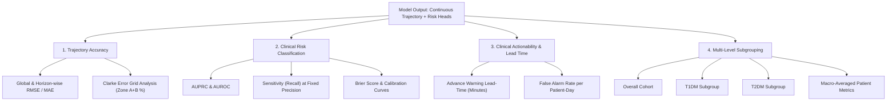

# GlucoShield: Unified Model Evaluation Protocol & Benchmark Standards

**Project**: GlucoShield – Multi-Modal AI & Digital Twin Diabetes Companion  
**Document**: Standard Operating Procedure (SOP) for Model Evaluation  
**Audience**: ML Engineers, Clinical AI Researchers, Data Scientists  
**Status**: **MANDATORY PROTOCOL** (Applies to all subsequent model architectures)

---

## 1. Overview & Evaluation Philosophy

In clinical glucose forecasting, generic aggregate regression metrics (such as global RMSE) are insufficient on their own. GlucoShield models must be evaluated against **multi-horizon accuracy**, **clinical risk classification**, **hypoglycemia early-warning lead time**, and **subgroup equity (T1DM vs. T2DM)**.

Every candidate model must adhere to the standardized protocol defined below.

---

## 2. Mandatory Metric Taxonomy



---

## 3. Detailed Metric Specifications

### 3.1 Trajectory Forecasting Metrics
Models generate a continuous trajectory $\hat{Y} = [\hat{g}_{t+1}, \hat{g}_{t+2}, \dots, \hat{g}_{t+20}] \in \mathbb{R}^{20}$ (15-min steps up to 5 hours ahead).

1. **Overall Root Mean Squared Error (RMSE)**:
   $$\text{RMSE} = \sqrt{\frac{1}{N \cdot K} \sum_{i=1}^N \sum_{k=1}^K (\hat{g}_{i, t+k} - g_{i, t+k})^2}$$
2. **Mean Absolute Error (MAE)**:
   $$\text{MAE} = \frac{1}{N \cdot K} \sum_{i=1}^N \sum_{k=1}^K |\hat{g}_{i, t+k} - g_{i, t+k}|$$
3. **Horizon-Wise RMSE & MAE**:
   * Reported individually for:
     * **1-Hour Horizon** ($k=4$, 60 min)
     * **2-Hour Horizon** ($k=8$, 120 min)
     * **3-Hour Horizon** ($k=12$, 180 min)
     * **4-Hour Horizon** ($k=16$, 240 min)
     * **5-Hour Horizon** ($k=20$, 300 min)
4. **Clarke Error Grid Analysis (EGA)**:
   * Percentage of predictions falling into **Zone A** (clinically accurate) and **Zone B** (benign errors that do not lead to inappropriate treatment).
   * **Target**: $\text{Zone A} + \text{Zone B} \ge 95.0\%$.

---

### 3.2 Clinical Risk Classification Metrics
Evaluated on binary risk predictions:
* **Hypoglycemia ($< 70\text{ mg/dL}$)** within 1h, 2h, and 4h.
* **Hyperglycemia ($> 180\text{ mg/dL}$)** within 2h and 4h.

1. **Area Under the Precision-Recall Curve (AUPRC)**:
   * Primary classification metric due to acute class imbalance ($\sim 7-10\%$ hypo prevalence).
2. **Area Under the ROC Curve (AUROC)**:
   * Standard discrimination metric.
3. **Sensitivity (Recall) for Hypoglycemia**:
   $$\text{Sensitivity} = \frac{\text{True Positives}}{\text{True Positives} + \text{False Negatives}}$$
   * *Clinical Priority*: Missing an impending crash ($\text{FN}$) is far more dangerous than a false alarm ($\text{FP}$).
4. **Brier Score & Calibration**:
   $$\text{Brier} = \frac{1}{N} \sum_{i=1}^N (p_i - y_i)^2$$
   * Evaluates whether predicted probabilities ($P(\text{Hypo}) = 0.75$) reflect true empirical frequencies.

---

### 3.3 Clinical Event Detection & Lead Time

1. **Advance Warning Lead-Time**:
   * Time (in minutes) between the initial model alarm ($P(\text{Hypo}) \ge \tau$) and the first sensor observation of $G_t < 70\text{ mg/dL}$.
   * **Clinical Benchmark**: Advance warning of $\ge 30\text{ minutes}$ is required to allow oral carbohydrate ingestion to take effect.
2. **False Alert Rate**:
   * Number of false positive alarms per patient-week of monitoring.

---

## 4. Subgroup Stratification & Aggregation Rules

To prevent high-volume sequence patients and the large T2DM cohort from distorting results, all metrics must be reported across **4 standard evaluation tables**:

1. **Overall Cohort Metrics** (Pooled across all 4,113 test sequences).
2. **T1DM Subgroup Metrics** ($N=507$ test sequences across Patients `1004` and `1007`).
3. **T2DM Subgroup Metrics** ($N=3,606$ test sequences across 15 test patients).
4. **Macro-Averaged Patient-Level Metrics**:
   * Compute metric $M_p$ for each individual patient $p \in \text{Test}$, then calculate:
     $$\bar{M}_{\text{macro}} = \frac{1}{|P_{\text{test}}|} \sum_{p=1}^{|P_{\text{test}}|} M_p$$
   * Report mean $\pm$ standard deviation across patients.

### Statistical Confidence Intervals
* 95% Confidence Intervals must be computed via **Patient-Level Bootstrap** ($B=1,000$ resamples with replacement of test patient clusters).

---

## 5. Mandatory Benchmark Comparison Hierarchy

Every proposed advanced architecture (e.g. Deep Digital Twin, Temporal Fusion Transformer, Physics-Informed Neural ODE) must be benchmarked against the following **6 standardized baselines** on identical test sequences:

| Baseline Tier | Model Name | Description & Mechanism |
| :--- | :--- | :--- |
| **Tier 1: Static Baseline** | **Persistence** | Assumes flat trajectory: $\hat{g}_{t+k} = g_t$ for all $k \in [1, 20]$. |
| **Tier 2: Kinematic Baseline** | **Linear Velocity Extrapolation** | Extrapolates current 15-min rate of change: $\hat{g}_{t+k} = g_t + k \cdot v_t$. |
| **Tier 3: Classical ML** | **Ridge / Random Forest** | Multi-output regressor on flattened past 96 steps + rolling features. |
| **Tier 4: Pure Neural Core** | **Standard LSTM / GRU** | 2-layer LSTM trained directly on 22 dynamic input channels to predict 20 future steps. |
| **Tier 5: Physics-Only Twin** | **Bergman Minimal ODE** | Solves Bergman 3-variable ODE using nominal population parameters ($p_1, p_2, p_3, n, G_b, I_b$) driven by future scheduled insulin and estimated carbs. |
| **Tier 6: Hybrid Digital Twin** | **Bergman ODE + Residual LSTM** | Physics ODE computes nominal metabolic trajectory; LSTM learns unmodeled residual error ($\Delta G$). |

---

## 6. Required Reporting Template

Every future model evaluation experiment log must include the following standard scorecard:

```markdown
### Model Scorecard: [Model Name / Architecture]
- **Test Set Size**: 4,113 sequences (17 patients: 2 T1DM, 15 T2DM)

| Horizon / Subgroup | Overall RMSE | T1DM RMSE | T2DM RMSE | Macro-Patient RMSE | Hypo 4h AUPRC | Hypo 4h Sensitivity | Clarke A+B (%) |
| :--- | :--- | :--- | :--- | :--- | :--- | :--- | :--- |
| **1-Hour (60m)** | — | — | — | — | — | — | — |
| **2-Hour (120m)** | — | — | — | — | — | — | — |
| **4-Hour (240m)** | — | — | — | — | — | — | — |
| **5-Hour (300m)** | — | — | — | — | — | — | — |
```

---

## 7. Protocol Enforcement

* No model may be promoted to production or described as achieving superior performance without beating **Tier 1 (Persistence)**, **Tier 4 (Standard LSTM)**, and **Tier 5 (Physics ODE)** across both Overall and Subgroup metrics.
* Any claim regarding T1DM generalizability must explicitly state that the evaluation cohort comprises 2 test patients with 507 sliding sequences.
